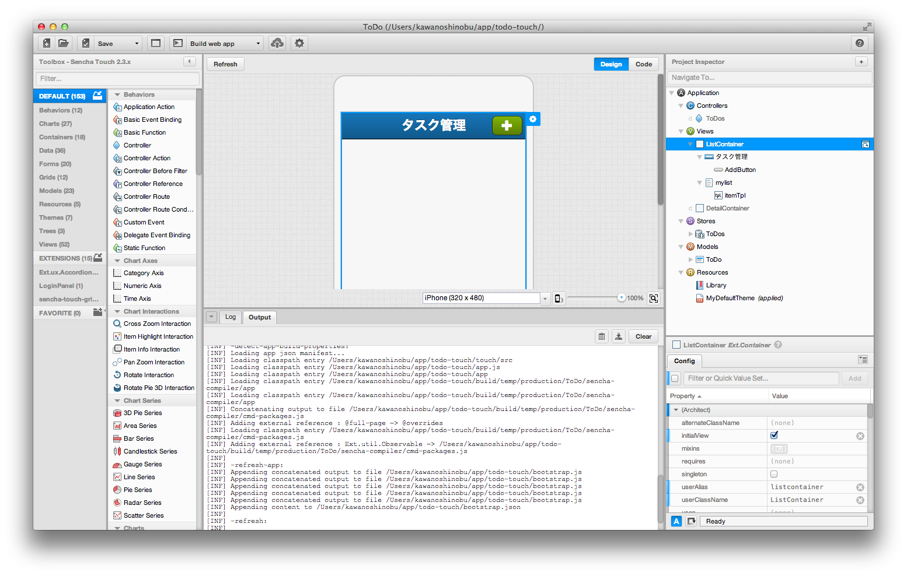

todo-touch
=================

「タスク管理」アプリは、タスクデータを閲覧、追加、編集、削除するアプリケーションです。一覧画面と詳細画面の2つの画面を持ち、一覧のレコードをタップして詳細画面に遷移します。詳細画面では、詳細情報の参照とデータの更新を行います。アプリで扱うデータはWebブラウザのローカルストレージに保存します。

<div>
    
    
    
    
</div>

## 事前準備

以下のソフトウェアをご利用マシンにインストールして下さい。

* Sencha Architect 3.x
* Sencha Cmd 4.x

## インストールと起動

1. リポジトリを clone します。

    ```
    $ git clone https://github.com/senchasabo/todo-touch.git
    ```

2. Sencha Architect を起動し、`ToDo.xds`を開きます。

3. プロジェクトを保存します。Sencha Cmd の初期化処理が実行され、必要なライブラリがインストールされます。

    

4. ターミナルからリポジトリを clone したディレクトリに移動し、Sencha Cmd に同梱されている Web サーバーを起動します。

    ```
    $ sencha web start
    ```

5. ブラウザから `http://localhost:1841` にアクセスします。

## 外部サイトのご利用について

- キヤノンITソリューションズ株式会社（以下キヤノンITソリューションズ）は、外部サイトに情報を掲載する際には万全を期していますが、それらの情報が正確であるか、完全であるか、最新であるか、またお客さまにとって有用であるかなどについて、一切保証致しません。
- キヤノンITソリューションズは、お客さまが外部サイトをご利用になったことにより生じたいかなる損害についても責任を負いません。
- キヤノンITソリューションズは、外部サイトで公開されている情報の変更、削除などは、原則としてお客さまへの予告なしに行います。また、止むを得ない事由により、外部サイトの公開を中断あるいは中止させていただくことがあります。
- キヤノンITソリューションズは、外部サイトの情報の変更、削除、公開の中断、中止により、お客さまに生じたいかなる損害についても責任を負いません。

## 著作権・商標などについて

- 外部サイトに掲載されているコンテンツ（文書、映像、音声、プログラムなど）は、各国の著作権法、知的財産権に関する法令で保護されています。
- これらのコンテンツの全部または一部を、権利者の許可なく複製、公開、送信、頒布、譲渡、翻案、転用などする事は、法令で禁止されています。

